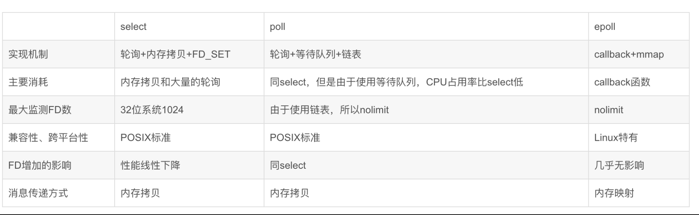

五种IO模型包括：阻塞IO、非阻塞IO、信号驱动IO、IO多路转接、异步IO。其中，前四个被称为同步IO。
在内核数据copy到用户空间时都是阻塞的。

[TOC!]

# 阻塞IO （BIO）

　　使用recv的默认参数一直等数据直到拷贝到用户空间，这段时间内进程始终阻塞。打个比方，A同学排队买票，他只能排队买上票才可以离开。这一过程就可以看成使用了阻塞       IO模型，因为如果在没买到票之前，他不能离开队伍做别的事情（离开等于白排队，回来又要重新排队）。很显然这种，I/O模型是同步的。

# 非阻塞IO（NIO）

　改变flags,让recv不管有没有获取到数据都返回，如果没有数据那么一段时间后再调用recv看看，如此循环。对比阻塞模型，相当于A同学买票过程中，采用了取号买票，再没有到他前，他可以不断的返回购票大厅看下是不是到了自己的号，中间的过程可以做其他事情。他就不用向之前一样一刻不能离开购票大厅。这就是非阻塞IO模型。但是它只有是检查无数据的时候是非阻塞的，在数据到达的时候依然要等待复制数据到用户空间(到自己的号买上票)，因此它还是同步IO。

# 信号驱动IO 

# IO多路复用

## 什么是IO多路复用：
I/O多路复用，I/O是指网络I/O, 多路指多个TCP连接(即socket或者channel），复用指复用一个或几个线程。
            简单来说：就是使用一个或者几个线程处理多个TCP连接
            最大优势是减少系统开销小，不必创建过多的进程/线程，也不必维护这些进程/线程

## 常用应用场景是什么？
客户端要处理多个socket
客户端同时处理连接和用户输入，比如聊天室
TCP服务器要同时处理监听socket和连接socket
服务器同时处理TCP和UDP
服务器要监听多个端口

**举例**
I/O框架libevent
基于libevent和协程的python网络框架gevent
python的高性能web框架tornado
redis文件事件处理器
nginx，apache事件模型

## 多路复用的实现方式

				
### select
基本原理：
	监视文件3类描述符： writefds、readfds、和exceptfds
	调用后select函数会阻塞住，等有数据 可读、可写、出异常 或者 超时 就会返回
	select函数正常返回后，通过遍历fdset整个数组才能发现哪些句柄发生了事件，来找到就绪的描述符fd，然后进行对应的IO操作
	几乎在所有的平台上支持，跨平台支持性好

缺点：
	1）select采用**轮询**的方式扫描文件描述符，全部扫描，随着文件描述符FD数量增多而性能下降
	2）每次调用 select()，需要把 fd 集合从用户态拷贝到内核态，并进行遍历(消息传递都是从内核到用户空间)
	2）最大的缺陷就是单个进程打开的FD有限制，默认是1024   （可修改宏定义，但是效率仍然慢）
		static final  int MAX_FD = 1024

### poll 
基本流程：
	select() 和 poll() 系统调用的大体一样，处理多个描述符也是使用轮询的方式，根据描述符的状态进行处理
	一样需要把 fd 集合从用户态拷贝到内核态，并进行遍历。
	最大区别是: poll没有最大文件描述符限制（使用链表的方式存储fd）
	
	
	
	
### epoll	
  llinux 独有
  

# 异步IO（NIO2.0 异步、非阻塞）

AIO是异步IO的缩写，虽然NIO在网络操作中，提供了非阻塞的方法，但是NIO的IO行为还是同步的。对于NIO来说，我们的业务线程是在IO操作准备好时，得到通知，接着就由这个线程自行进行IO操作，IO操作本身是同步的。

但是对AIO来说，则更加进了一步，它不是在IO准备好时再通知线程，而是在IO操作已经完成后，再给线程发出通知。因此AIO是不会阻塞的，此时我们的业务逻辑将变成一个回调函数，等待IO操作完成后，由系统自动触发。

与NIO不同，当进行读写操作时，只须直接调用API的read或write方法即可。这两种方法均为异步的，对于读操作而言，当有流可读取时，操作系统会将可读的流传入read方法的缓冲区，并通知应用程序；对于写操作而言，当操作系统将write方法传递的流写入完毕时，操作系统主动通知应用程序。 即可以理解为，read/write方法都是异步的，完成后会主动调用回调函数。 在JDK1.7中，这部分内容被称作NIO.2，主要在Java.nio.channels包下增加了下面四个异步通道：

AsynchronousSocketChannel
AsynchronousServerSocketChannel
AsynchronousFileChannel
AsynchronousDatagramChannel

在AIO socket编程中，服务端通道是AsynchronousServerSocketChannel，这个类提供了一个open()静态工厂，一个bind()方法用于绑定服务端IP地址（还有端口号），另外还提供了accept()用于接收用户连接请求。在客户端使用的通道是AsynchronousSocketChannel,这个通道处理提供open静态工厂方法外，还提供了read和write方法。

在AIO编程中，发出一个事件（accept read write等）之后要指定事件处理类（回调函数），AIO中的事件处理类是CompletionHandler<V,A>，这个接口定义了如下两个方法，分别在异步操作成功和失败时被回调。

void completed(V result, A attachment);

void failed(Throwable exc, A attachment);

用于连接数据多且连接比较长（重操作）的架构，比如相册服务器，充分调用OS参与并发操作，编程比较复杂 JDK1.7开始支持

# 总结

IO分两阶段：
1.数据准备阶段
2.内核空间复制回用户进程缓冲区阶段

　一般来讲：阻塞IO模型、非阻塞IO模型、IO复用模型(select/poll/epoll)、信号驱动IO模型都属于同步IO，因为阶段2是阻塞的(尽管时间很短)。只有异步IO模型是符合异步IO操作含义的，不管在阶段1还是阶段2都可以干别的事。

